# � Event-Driven Architecture (EDA) — The Party Edition!

---

## What is Event-Driven Architecture? (a.k.a. "Let’s Party!")

Imagine you’re at a party. Someone yells, “Pizza’s here!” and suddenly, everyone who cares about pizza runs to the door. That’s event-driven architecture: something happens (an event), and whoever is interested reacts. No one needs to know who ordered the pizza, just that it arrived!

In tech, EDA is when different parts of your app talk to each other by shouting out events, not by poking each other directly.

---

## Why Not Just Call Each Other? (Tight Coupling Woes)

Old-school apps are like a group project where everyone keeps tapping each other’s shoulder: “Hey, do your part!”

- If one person leaves, the whole thing falls apart.
- If you want to add a new friend, you have to tell everyone else about them.
- It’s chaos if someone’s busy (or asleep).

**Tight coupling** = everyone’s in everyone else’s business. Not fun.

### Tight Coupling Example (The Shoulder-Tapping Chain)

---

## How EDA Saves the Day (The Pizza Party Way)

With EDA, you just shout, “Pizza’s here!” and anyone who cares (maybe Bob, maybe Dave, maybe the dog) comes running. No direct poking, no drama.

- Add new friends? They just listen for the pizza shout.
- Someone busy? They’ll get the message when they’re ready.
- Want to leave? Just stop listening. No one’s mad.

### EDA Example (The Shout-Out System)

```mermaid
graph TD
  Alice -->|"Pizza’s here!"| PartyBus
  PartyBus --> Bob
  PartyBus --> Carol
  PartyBus --> Dave
```

---

## Quick Comparison Table

|                | Tight Coupling (Shoulder Tap) | Event-Driven (Shout-Out) |
|----------------|-------------------------------|--------------------------|
| How?           | Direct calls                  | Broadcast events         |
| Adding people  | Annoying                      | Super easy               |
| If someone’s out | Everything breaks           | No problem!              |
| Vibe           | Stressful                     | Chill                    |

---

## When Should You Throw an EDA Party?

- When you want your app to be chill, flexible, and drama-free
- When you want to add/remove features without a group meltdown
- When you want things to keep working even if someone’s away

---

  <b>Event-Driven Architecture: Because life’s too short for shoulder-tapping chaos! 🍕🎈</b>

